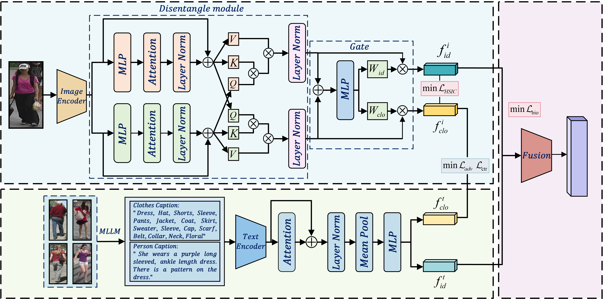

# Robust Person Re-Identification via MLLM-Supervised Feature Decoupling

***This repository contains the official LaTeX source code for our paper:***

***Aurhor:*** *<u>KeLong Yan</u>*

***arXiv:*** *<u>To be determined</u>*

***Gthub Code:***[yyykkklll/Text-based-Person-Retrieval_V3: 🎓基于文本指导的行人重识别（Text-to-Image ReID）模型，采用 ViT + BERT 架构，并融合门控机制与身份-衣物解耦设计 🚀 (github.com)](https://github.com/yyykkklll/Text-based-Person-Retrieval_V3)

---

## Abstract

> ***The challenge of fine-grained semantic alignment contin ues to hinder Text-to-Image Person Re-Identification, where clothing-induced interference and a persistent modality gap degrade retrieval accuracy. We introduce a novel framework that decouples identity and clothing features through Multi-Modal Large Language Model (MLLM)-guided supervision, enabling robust cross-modal matching.***

## Framework

***Our core approach involves decoupling traditionally coupled features (Figure a) into separate components (Figure b). We utilize the refined text generated by MLLM (identity/clothing) as supervision to force the model to decouple identity and clothing features, achieving robust cross-modal retrieval.***

### **Detailed Architecture**

***The figure below illustrates the detailed workflow of our proposed method, encompassing the BDAM module, the MLLM text generation process, and the multi-task loss employed for forced decoupling.***

## Warehouse Contents

***This repository contains all the LaTeX source files required to compile our paper, including:***

* ***`main.tex`: Main .tex file.***
* ***`*.bib`: References document.***
* ***`figures/`: Includes all images and charts used in the paper.***
